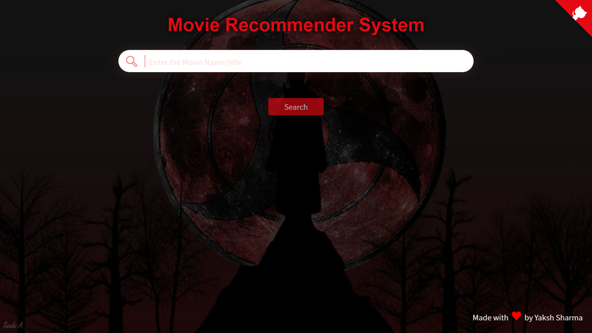
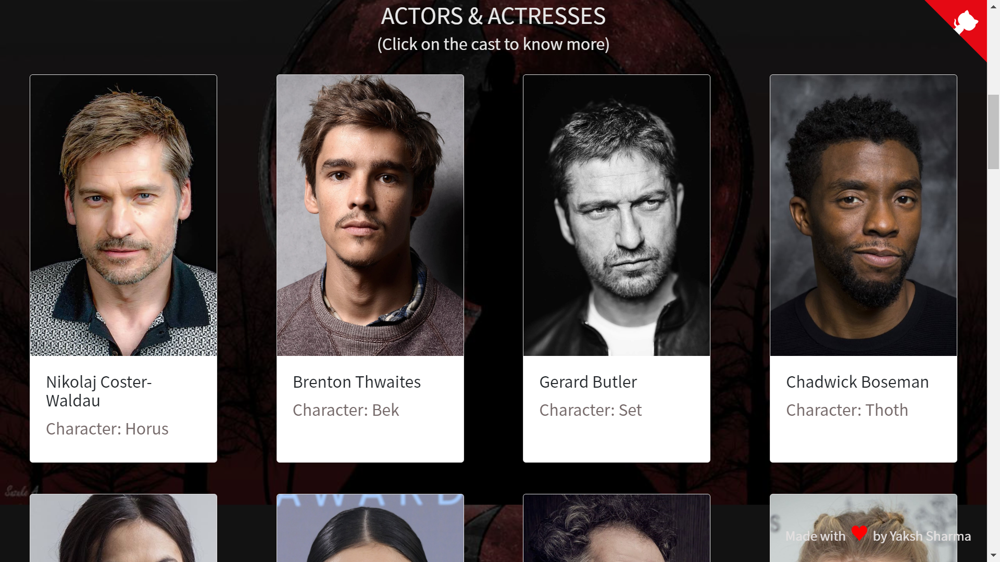
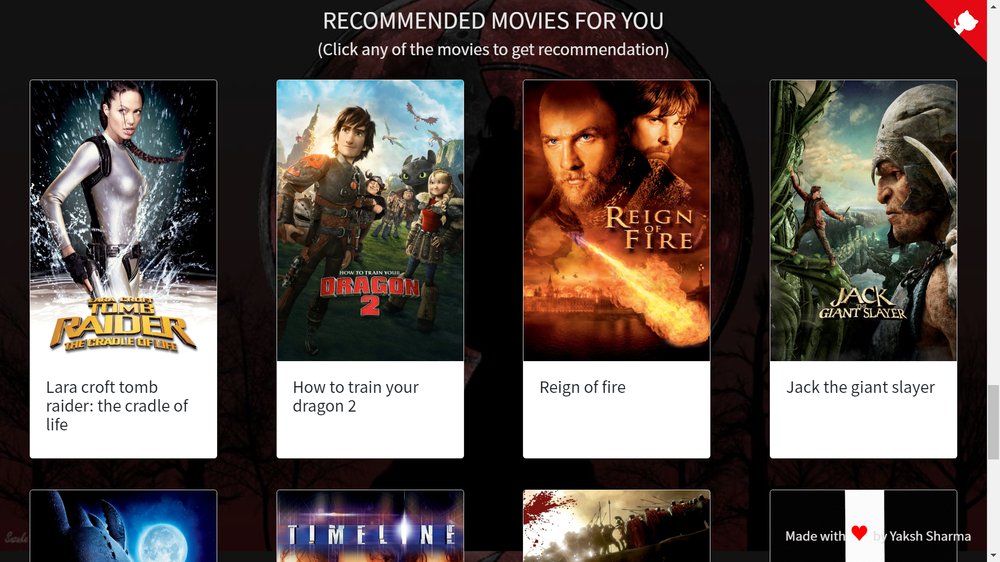

# Movie-Recommendation-System

A movie recommender system is an application that suggests movies to users based on their preferences, past viewing history, and ratings. This project aims to develop a personalized movie recommender system that can help users discover new movies that match their taste.

The project is built using Python and utilizes the scikit-learn library for machine learning algorithms. It also uses the pandas library for data manipulation and the Flask framework for web application development.

The data used in this project is sourced from the MovieLens dataset, which contains a vast collection of movie ratings from a large number of users. The dataset is preprocessed and transformed to generate user-item ratings matrix, which is then used for training the machine learning models.

The project consists of two main components: the back-end and the front-end. The back-end is responsible for processing the data, training the machine learning models, and generating movie recommendations for the users. The front-end is a web-based interface that allows users to interact with the system and receive movie recommendations.

The user interface of the system is designed to be user-friendly and intuitive. Users can search for movies, rate movies, and receive personalized recommendations based on their viewing history and preferences. The system also provides additional information about each movie, including its genre, director, and cast.

Overall, this movie recommender system project is an excellent example of how machine learning algorithms can be used to create personalized recommendations for users. It can help users discover new movies that they might not have found otherwise and enhance their overall movie-watching experience.

## Screenshots

